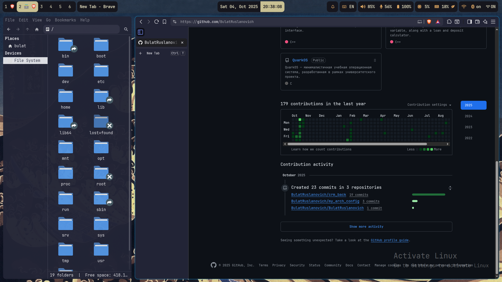
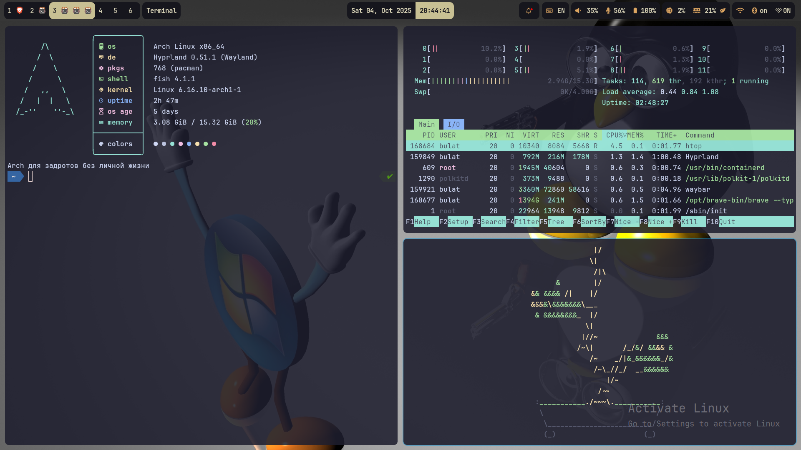
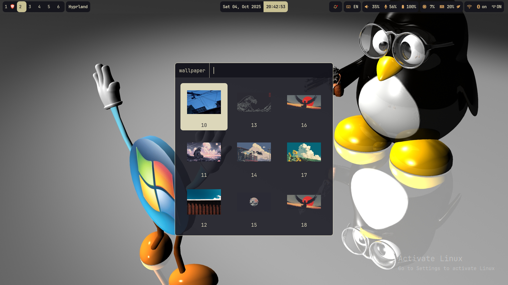
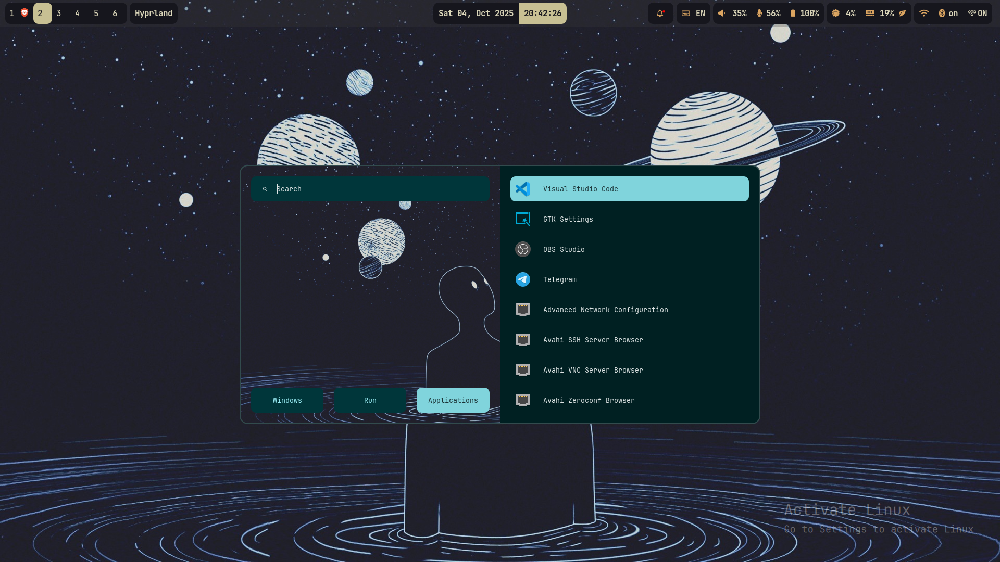
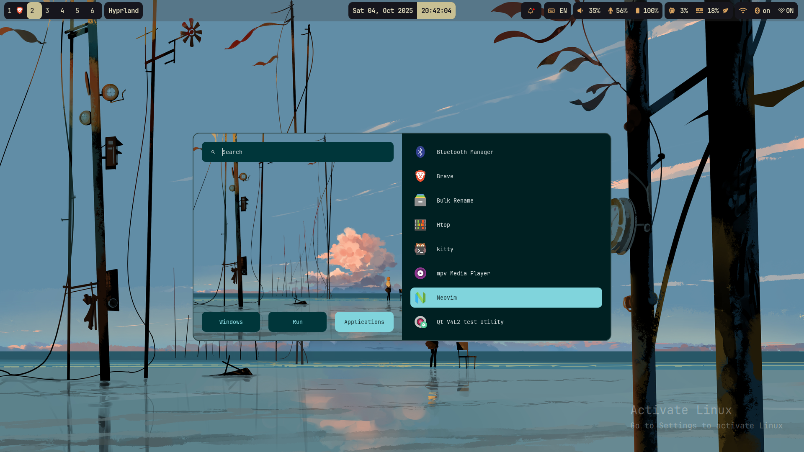
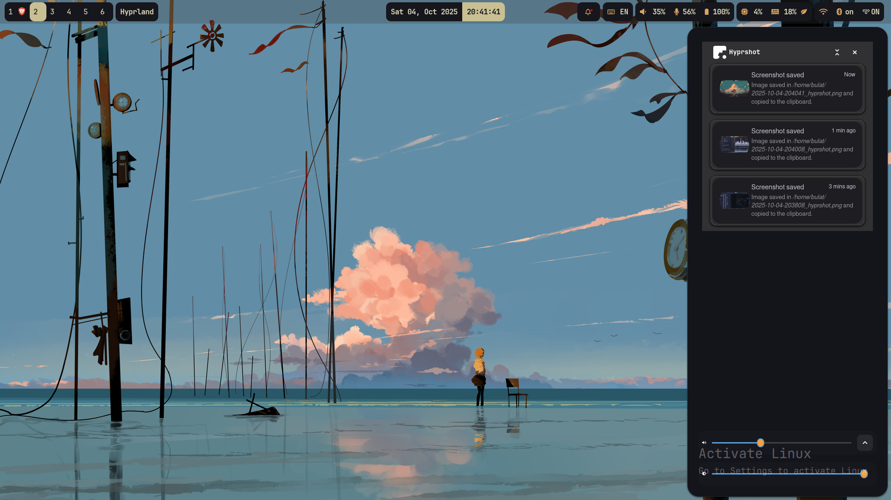
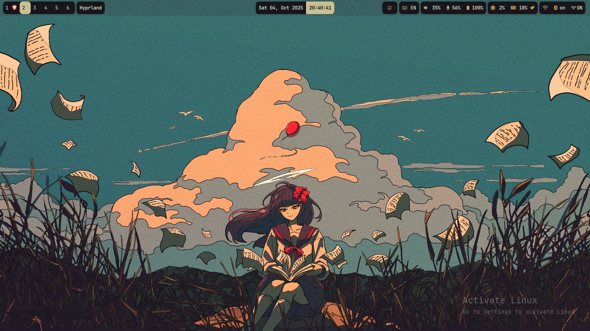
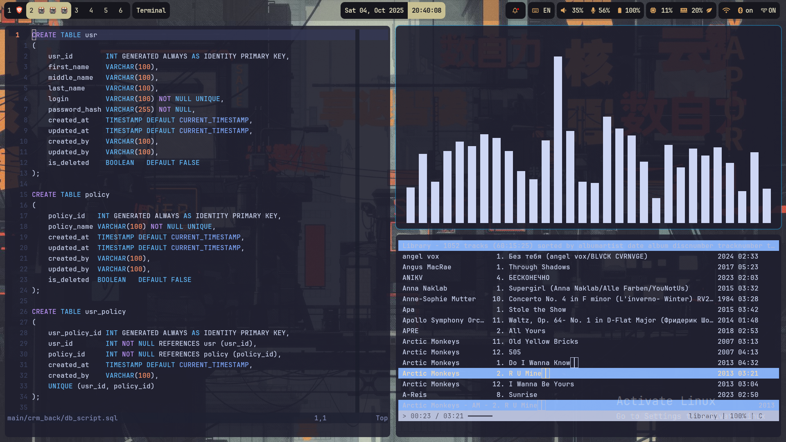

<div align="center">
  <p></p>
  <p><b><i>   </i></b></p>
  
</div>

---

## Screenshots

<div align="center">
  
  
</div>

<div align="center">
  
  
</div>

<div align="center">
  
  
</div>

<div align="center">
  
  
</div>

---

## Quick Setup

### Automated Installation

For a complete system setup with all required packages:

```bash
git clone https://github.com/BulatRuslanovich/my_arch_config
cd my_arch_config
chmod +x restore_system.sh
./restore_system.sh
```

**What the script does:**
- Installs all necessary packages automatically
- Configures systemd services
- Sets up fonts and dependencies
- Optionally installs AUR packages (Brave, VS Code)
- Optionally copies configs to ~/.config/

### Manual Installation

> **⚠️ Warning:** Backup your current configs before proceeding!

```bash
git clone https://github.com/BulatRuslanovich/my_arch_config
cd my_arch_config
cp -r * $HOME/.config
```

---

## What's Included

### Desktop Environment
- **Hyprland** - Dynamic tiling Wayland compositor
- **Waybar** - Highly customizable status bar
- **Rofi** - Application launcher and window switcher
- **SwayNC** - Notification daemon

### Essential Tools
- **Kitty** - GPU-accelerated terminal emulator
- **Neovim** - Modern Vim-based text editor
- **Fish** - User-friendly command line shell
- **Thunar** - File manager
- **btop** - System resource monitor

### Media & Utilities
- **Pipewire** - Audio system
- **MPV** - Media player
- **Grim/Slurp** - Screenshot tools
- **Cava** - Audio visualizer

### System Components
- **NetworkManager** - Network management
- **Bluetooth** - Wireless connectivity
- **Power Profiles** - Power management
- **Polkit** - Authorization framework

---


## Requirements

- Arch Linux (or Arch-based distributions)
- Wayland-compatible graphics drivers
- Internet connection for package installation
